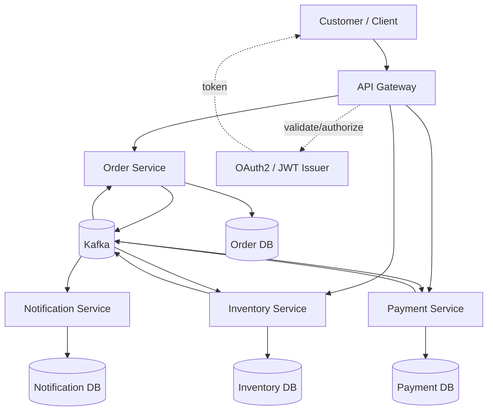
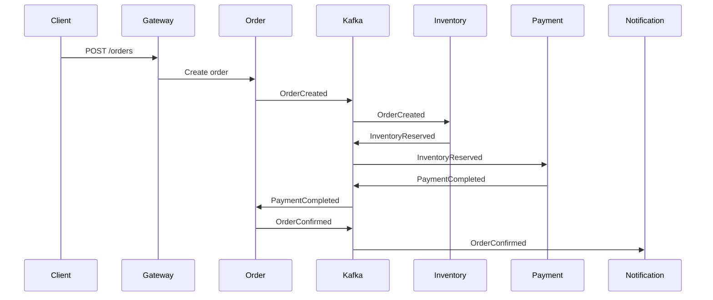
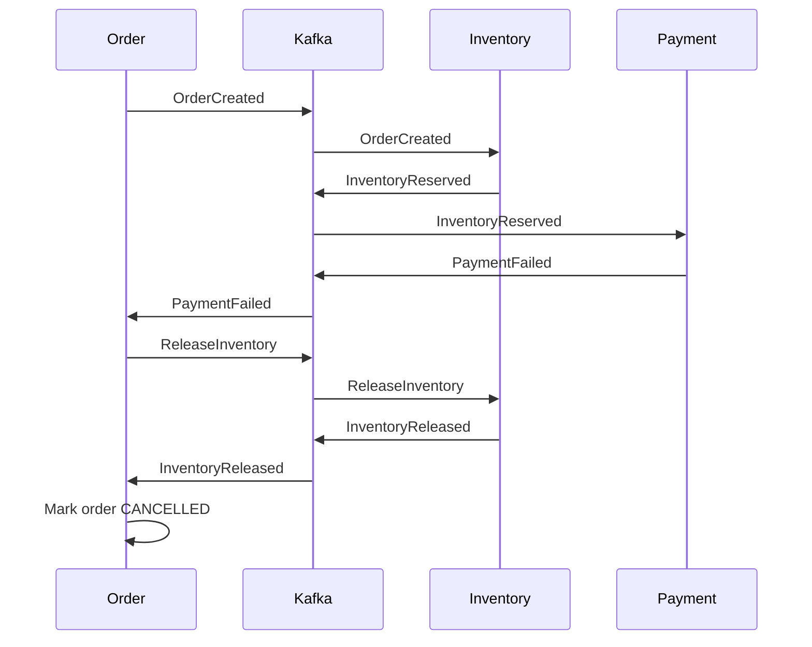

# System Context

```mermaid
flowchart TD
    C[Customer / Client] --> G[API Gateway]

    G --> O[Order Service]
    G --> I[Inventory Service]
    G --> P[Payment Service]

    O --> K[(Kafka)]
    I --> K
    P --> K

    K --> O
    K --> I
    K --> P
    K --> N[Notification Service]

    O --> OD[(Order DB)]
    I --> ID[(Inventory DB)]
    P --> PD[(Payment DB)]
    N --> ND[(Notification DB)]

    AUTH[OAuth2 / JWT Issuer] -. token .-> C
    G -. validate/authorize .-> AUTH
```

## Initial order workflow

```mermaid
sequenceDiagram
    participant C as Client
    participant G as Gateway
    participant O as Order
    participant K as Kafka
    participant I as Inventory
    participant P as Payment
    participant N as Notification

    C->>G: POST /orders
    G->>O: Create order
    O->>K: OrderCreated
    K->>I: OrderCreated
    I->>K: InventoryReserved
    K->>P: InventoryReserved
    P->>K: PaymentCompleted
    K->>O: PaymentCompleted
    O->>K: OrderConfirmed
    K->>N: OrderConfirmed
```

## Failure path

```mermaid
sequenceDiagram
    participant O as Order
    participant K as Kafka
    participant I as Inventory
    participant P as Payment

    O->>K: OrderCreated
    K->>I: OrderCreated
    I->>K: InventoryReserved
    K->>P: InventoryReserved
    P->>K: PaymentFailed
    K->>O: PaymentFailed
    O->>K: ReleaseInventory
    K->>I: ReleaseInventory
    I->>K: InventoryReleased
    K->>O: InventoryReleased
    O->>O: Mark order CANCELLED
```
