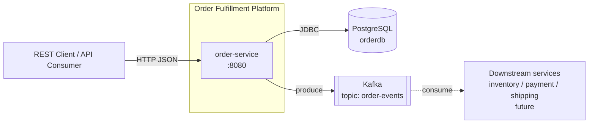
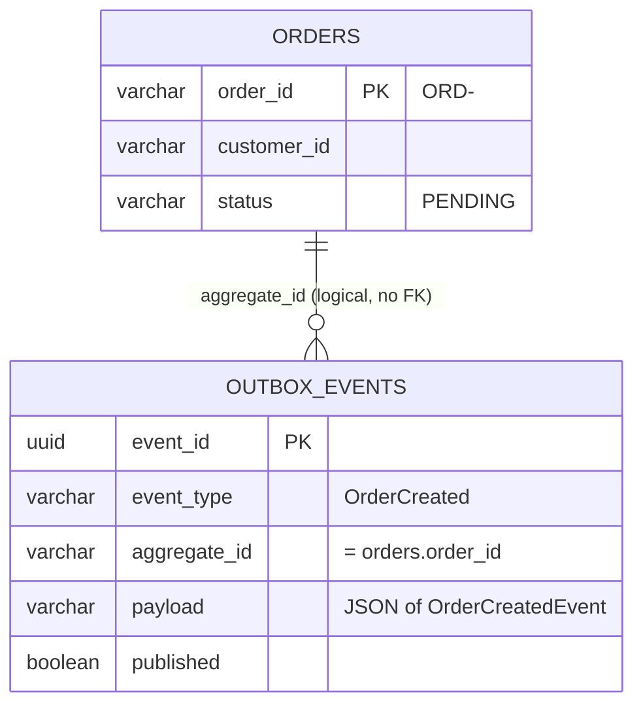
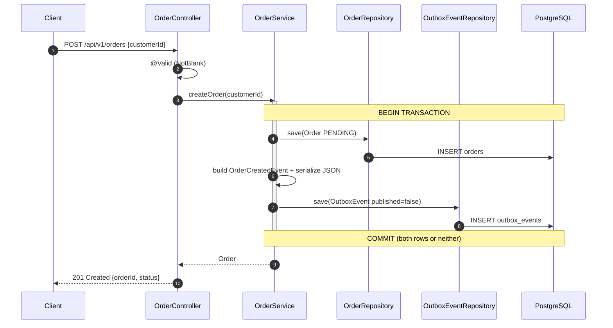
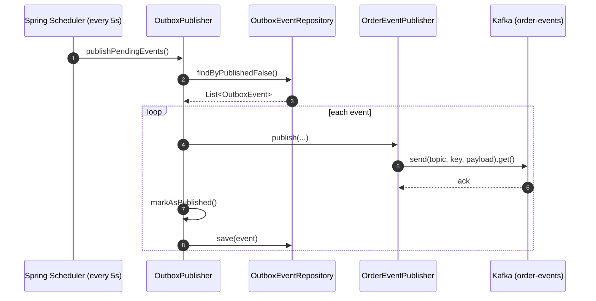
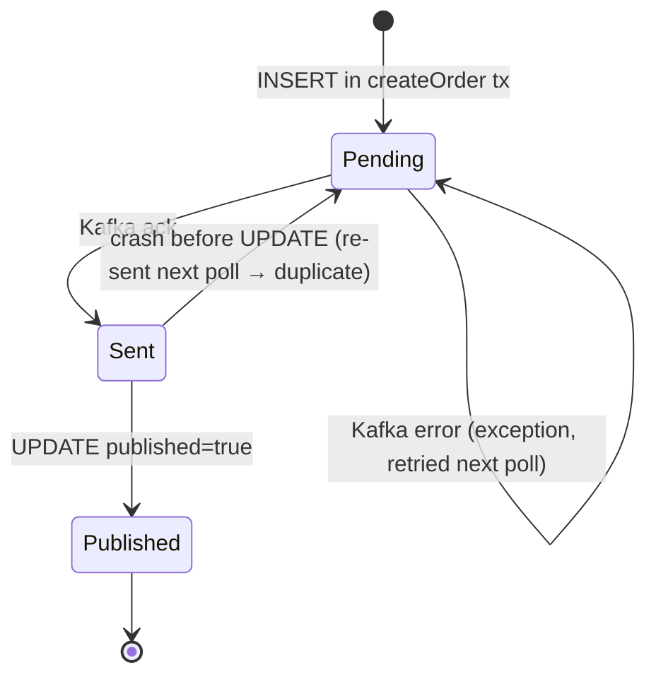
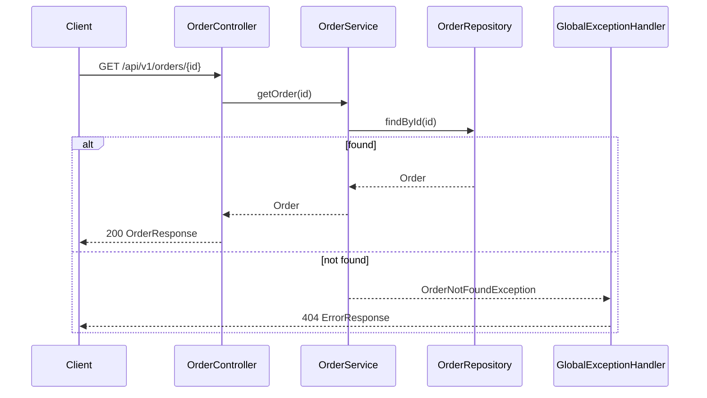
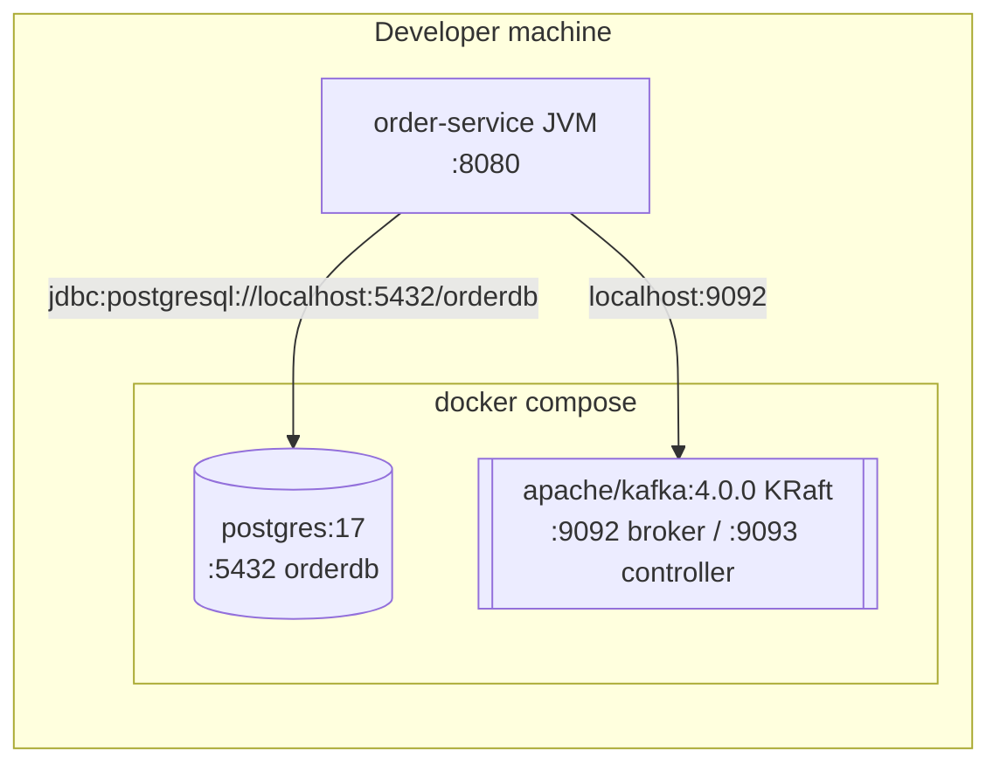

# Order Service: Architecture & Code Walkthrough

## 1. Overview

`order-service` is the first module of the **Order Fulfillment Platform**, a Maven multi-module project. It:

1. Accepts orders over a REST API.
2. Saves them to **PostgreSQL**.
3. Publishes an `OrderCreated` domain event to **Kafka** using the **Transactional Outbox pattern**. This means saving to the database and publishing to Kafka stay consistent, without needing a distributed transaction.

| Concern        | Technology                                  |
|----------------|---------------------------------------------|
| Language       | Java 21                                     |
| Framework      | Spring Boot 4.1.1 (parent POM)              |
| Web            | `spring-boot-starter-webmvc`                |
| Validation     | `spring-boot-starter-validation` (Jakarta)  |
| Persistence    | Spring Data JPA + Hibernate + PostgreSQL 17 |
| Messaging      | `spring-boot-starter-kafka`, Apache Kafka 4.0 (KRaft) |
| JSON           | Jackson 3 (`tools.jackson.databind.ObjectMapper`) |
| Scheduling     | `@EnableScheduling` + `@Scheduled`          |
| Local infra    | `docker-compose.yml` (Postgres + Kafka)     |

---

## 2. System Context



---

## 3. Module & Package Structure

```
order-fulfillment-platform/
├── pom.xml                      # parent (spring-boot-starter-parent 4.1.1, modules)
├── docker-compose.yml           # postgres:17 + apache/kafka:4.0.0
└── order-service/
    ├── pom.xml
    └── src/main/java/com/levelup/order/
        ├── OrderServiceApplication.java   # @SpringBootApplication @EnableScheduling
        ├── controller/   OrderController
        ├── service/      OrderService
        ├── domain/       Order (JPA entity)
        ├── repository/   OrderRepository (port), JpaOrderRepository (adapter)
        ├── outbox/       OutboxEvent, OutboxEventRepository, OutboxPublisher
        ├── messaging/    OrderCreatedEvent, OrderEventPublisher
        ├── dto/          CreateOrderRequest, OrderResponse, ErrorResponse
        └── exception/    OrderNotFoundException, GlobalExceptionHandler
```

### Layered / component view

```mermaid
flowchart TB
    subgraph API[API Layer]
        C[OrderController]
        GEH[GlobalExceptionHandler]
        DTO[DTOs<br/>CreateOrderRequest / OrderResponse / ErrorResponse]
    end

    subgraph APP[Application Layer]
        S[OrderService]
    end

    subgraph DOMAIN[Domain]
        O[Order entity]
        E[OrderCreatedEvent record]
    end

    subgraph INFRA[Infrastructure]
        OR[OrderRepository interface]
        JOR[JpaOrderRepository]
        OER[OutboxEventRepository]
        OE[OutboxEvent entity]
        OP[OutboxPublisher<br/>@Scheduled 5s]
        EP[OrderEventPublisher<br/>KafkaTemplate]
    end

    C --> S
    C --> DTO
    GEH --> DTO
    S --> OR
    S --> OER
    S --> O
    S --> E
    JOR -. implements .-> OR
    OP --> OER
    OP --> EP
    OER --> OE
```

---

## 4. Component Details

### 4.1 `OrderServiceApplication`
The entry point. `@EnableScheduling` activates the `@Scheduled` outbox poller.

### 4.2 `OrderController` (`/api/v1/orders`)

| Method | Path                          | Request body                | Success           | Errors            |
|--------|-------------------------------|-----------------------------|-------------------|-------------------|
| GET    | `/api/v1/orders/health`       | –                           | `200` plain text  | –                 |
| POST   | `/api/v1/orders`              | `{"customerId":"CUST-1"}`   | `201 OrderResponse` | `400` validation |
| GET    | `/api/v1/orders/{orderId}`    | –                           | `200 OrderResponse` | `404` not found  |

`OrderResponse` = `{ "orderId": "ORD-<uuid>", "status": "PENDING" }`

### 4.3 `OrderService`
- `createOrder(customerId)` runs inside one database transaction (`@Transactional`) and:
    1. Creates the order ID `ORD-<UUID>` with status `PENDING`.
    2. Saves the `Order`.
    3. Builds an `OrderCreatedEvent(eventId, orderId, customerId, occurredAt, version=1)`.
    4. Serializes the event to JSON with Jackson 3.
    5. Saves an `OutboxEvent(eventId, "OrderCreated", orderId, payload, published=false)`.
- `getOrder(orderId)` returns the order or throws `OrderNotFoundException`.

### 4.4 Repositories
- `OrderRepository` is a small domain-facing interface (`save`, `findById`). The service depends only on this interface.
- `JpaOrderRepository extends JpaRepository<Order,String>, OrderRepository` lets Spring Data supply the implementation. This is a light ports-and-adapters setup.
- `OutboxEventRepository` adds the derived query `findByPublishedFalse()`.

### 4.5 Outbox relay
- `OutboxPublisher.publishPendingEvents()` runs every **5 s** (`fixedDelay`). It reads unpublished outbox rows, sends each one to Kafka, and then marks it `published=true`.
- `OrderEventPublisher` sends to topic **`order-events`** with `KafkaTemplate<String,String>`. It calls `.get()` to wait synchronously for the broker to acknowledge each send.

### 4.6 Error handling
`GlobalExceptionHandler` (`@RestControllerAdvice`) maps:
- `OrderNotFoundException` to **404**
- `MethodArgumentNotValidException` to **400**, with a list of field errors

```json
{
  "timestamp": "2026-10-04T18:00:00Z",
  "status": 400,
  "message": "Validation failed",
  "path": "/api/v1/orders",
  "errors": [{ "field": "customerId", "message": "Customer ID must not be blank" }]
}
```

---

## 5. Data Model



Hibernate creates and updates the schema (`spring.jpa.hibernate.ddl-auto=update`).

### Event payload (`OrderCreatedEvent`)
```json
{
  "eventId": "3f1c...",
  "orderId": "ORD-9a2b...",
  "customerId": "CUST-100",
  "occurredAt": "2026-10-04T18:00:00Z",
  "version": 1
}
```

---

## 6. Runtime Flows

### 6.1 Create order (synchronous part)



### 6.2 Outbox relay (asynchronous part)



### 6.3 Outbox event lifecycle



### 6.4 Get order



---

## 7. Why the Transactional Outbox?

Writing to the database and then calling Kafka directly can go wrong in two ways:
- If the database commit succeeds and the Kafka send fails, the **event is lost**.
- If the Kafka send succeeds and the database rolls back, a **"ghost" event** is published for an order that doesn't exist.

The outbox stores the event in the **same local transaction** as the order. A separate relay then publishes it. This gives **at-least-once** delivery, so consumers must be **idempotent** and deduplicate by `eventId`.

---

## 8. Deployment / Local Setup



```bash
docker compose up -d
cd order-service
./mvnw spring-boot:run          # Windows: mvnw.cmd spring-boot:run

curl -X POST http://localhost:8080/api/v1/orders -H "Content-Type: application/json" -d "{\"customerId\":\"CUST-100\"}"
curl http://localhost:8080/api/v1/orders/<orderId>
```

Key configuration (`application.properties`):
- Datasource: `orderdb` / `orderuser`
- `ddl-auto=update`, `show-sql=true`, JDBC time zone `Asia/Kolkata`
- Kafka: `localhost:9092`, String key/value serializers. The topic is auto-created by the broker's default settings.

---

## 9. Testing

| Test | Type | Notes |
|------|------|-------|
| `OrderServiceTest` | Unit (Mockito) | Covers create, get-found, and get-not-found. It does **not** check that the outbox row is saved. `ObjectMapper` is mocked, so the payload is `null`. |
| `OrderPersistenceIntegrationTest` | `@SpringBootTest` | Needs Postgres **and** Kafka running locally. There's no Testcontainers setup. |
| `OrderServiceApplicationTests` | Context load | Same infrastructure requirement as above. |

---

## 10. Findings & Recommendations

### Bugs
1. **Kafka key/argument mismatch.** `OrderEventPublisher.publish(eventId, orderId, payload)` is called as `publish(event.getAggregateId(), event.getEventId().toString(), ...)`. As a result, the **Kafka key is the eventId rather than the orderId**, so events for the same order aren't guaranteed to arrive in order. Fix the argument order. The `eventId` parameter is also never used; consider sending it as a Kafka header.
2. **Unneeded Jackson 2 dependency.** The POM declares `com.fasterxml.jackson.core:jackson-databind`, but the code uses Jackson 3 (`tools.jackson`). You can remove it.

### Reliability
3. The relay has no locking. If you run several instances, each one publishes the same rows. Use `SELECT ... FOR UPDATE SKIP LOCKED`, ShedLock, or leader election.
4. If one send fails, the exception stops the whole batch. Catch errors per event, log them, and track retry count and last error.
5. Add `created_at` and `published_at` columns. Process rows in `ORDER BY created_at` with a batch limit, and clean up or archive published rows.
6. `payload` is a default `varchar(255)`. Use `@Column(columnDefinition = "jsonb")` or `TEXT`.
7. Enable an idempotent producer (`enable.idempotence=true`, `acks=all`). Also send an `eventType` header so consumers can route events.

### Code quality
8. Use Spring's `org.springframework.transaction.annotation.Transactional` instead of the `jakarta` one, and mark `getOrder` as `readOnly = true`.
9. Model `status` as an enum (`PENDING`, `CONFIRMED`, `CANCELLED`, ...) and add audit timestamps to `Order`.
10. `OrderResponse` leaves out `customerId`. Decide whether that's intentional.
11. Add a catch-all `@ExceptionHandler(Exception.class)` that returns a 500 `ErrorResponse`.
12. Replace the custom `/health` endpoint with Spring Boot Actuator.

### Ops & testing
13. Move the database credentials into environment variables or profiles. Use Flyway or Liquibase instead of `ddl-auto=update`.
14. Use Testcontainers (Postgres + Kafka) so integration tests don't depend on locally running services. Add a unit test that checks the outbox row is saved, and an end-to-end test of the relay.